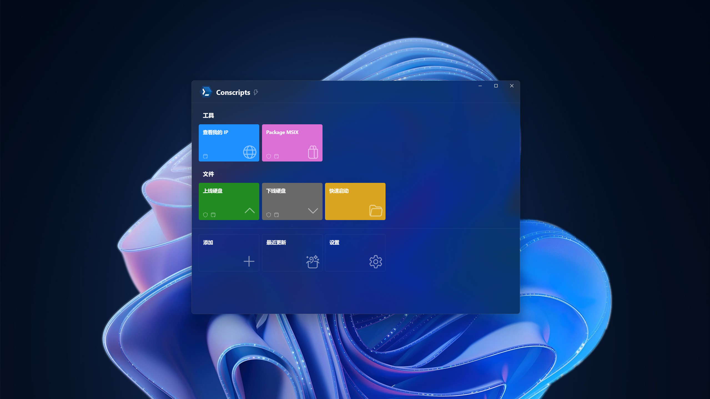

    

<h3 align="center">Conscripts, organize BAT and PS1 scripts neatly</h3>

Are you a frequent user of script files? Whether it's batch files or PowerShell scripts, no matter how complex the operation, a simple double-click is all it takes to let the script handle everything automatically—pure convenience.

But as your collection of script files grows, finding the right one among a sea of identical icons can become frustrating and far from elegant. If this sounds familiar, then welcome to Conscripts—your centralized script launcher. It keeps all your script files hidden behind the scenes, replacing them with rich icons and vibrant cards for a more refined experience.

> 您是否是一位脚本文件的使用者？无论是批处理文件还是 PowerShell 脚本，不管多复杂的操作，只要轻轻双击，就可以等待脚本自动把所有工作都完成，这一切都是那么的美好。
> 
> 只是，当脚本文件越来越多时，每次想要运行脚本，就要从众多图标一样的文件中，找到想要运行的脚本文件，这让人心烦，这不够优雅。如果您也有这种烦恼，那欢迎来体验一下 Conscripts，它是脚本文件的启动中心，将所有的脚本文件藏在幕后，取而代之的，是丰富的图标，和多彩的卡片。

